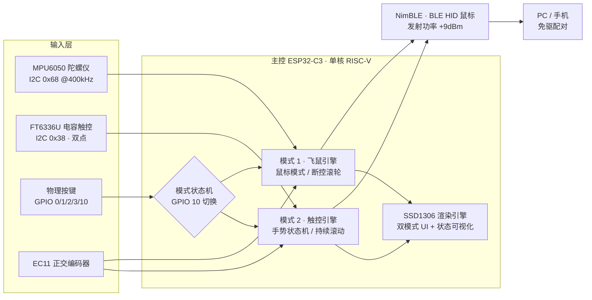

# ESP32-C3 可穿戴式智能飞鼠 · Wearable Smart Gesture Mouse

**一个用 7 个 GPIO 承载 10 种功能角色、跑通「空中飞鼠 + 电容触控板 + 旋钮滚轮」三合一交互的可穿戴 HID 外设 —— 从驱动寄存器、手势状态机到手机端调参 App 的全栈自研实现。**


---

## 📌 30 秒速览

| | |
| :--- | :--- |
| **做了什么** | 一块可握持/佩戴的智能外设，倾斜机身即控光标，翻到背面即是双指触控板，侧旋钮滚动页面；以标准 BLE HID 鼠标身份免驱接入 PC / 手机 |
| **技术亮点 1** | **GPIO 时域复用架构**：仅用 7 个 GPIO 承载 10 种功能角色（其中 GPIO 0~3 在多种工作状态下被重新绑定），不依赖端口扩展芯片 |
| **技术亮点 2** | **寄存器级实时优化**：ISR 内 `REG_READ(GPIO_IN_REG)` 直读正交编码器状态机；陀螺仪「静态标定 + 一阶低通 + 双层死区」三段式消噪链路 |
| **技术亮点 3** | **时钟驱动的手势引擎**：从事件驱动改为位置/速度时钟驱动，彻底解决双指滑动滚动的断续卡顿 |
| **技术亮点 4** | **全栈闭环**：自研 uni-app + Vue 3 调参 App，自定义 128-bit GATT 服务 + 帧协议设计（固件侧联调进行中） |
| **代码量** | 固件 ≈1290 行 C/C++（6 个源文件 + 6 个头文件，三层模块化）+ 手机端 ≈790 行 Vue/JS |
| **角色** | 硬件选型与引脚复用矩阵设计、固件开发、移动端 App 开发、技术复盘文档 |

### English Overview

A wearable three-in-one gesture mouse built on **ESP32-C3**, combining an **air mouse (MPU6050)**, a **capacitive touchpad (FT6336U)** and a **rotary-encoder scroll wheel (EC11)** behind a single BLE HID interface. The core engineering idea is **time-domain GPIO multiplexing**: only 7 GPIOs serve 10 distinct functional roles, switched at runtime by a mode state machine, so no port expander is required. Firmware is organised in three layers (scheduler / drivers / gesture engines) with a strictly budgeted 15 ms HID reporting window on a single-core RISC-V MCU, alongside a self-built **uni-app + Vue 3** configuration app with a custom GATT service.

---

## 演示

> 📸 目前仓库尚未包含演示素材。建议补充以下文件后启用本节，访客的首次浏览体验会显著提升：
>
> ```markdown
> | 实物接线 | OLED 运行界面 | 飞鼠演示 | 触控手势演示 |
> | :---: | :---: | :---: | :---: |
> |  |  |  |  |
> ```
>
> 建议放置于 `docs/` 目录，GIF 控制在 5 MB 以内；如有实测视频，可加一行链接到 B 站/YouTube。

---

## 系统架构



固件按 **「主控调度 → 硬件驱动 → 手势/模式行为」** 三层组织，每个模式模块统一暴露 `initXxx()` / `updateXxx()` 两个接口，由 `main.cpp` 的时间片状态机调用：

| 层 | 文件 | 职责 |
| :--- | :--- | :--- |
| 调度层 | `src/main.cpp` | I2C/BLE/OLED 初始化、模式状态机、`loop()` 时间片调度、模式切换键去抖扫描 |
| 行为层 | `src/mouse_mode.cpp`（246 行） | 模式 1：零偏标定、滤波、左右键、断控滚轮、灵敏度环形调节 |
| 行为层 | `src/touch_mode.cpp`（392 行） | 模式 2：FT6336U 双点解析、手势状态机、持续滚动引擎 |
| 驱动层 | `src/mpu6050_driver.cpp`、`src/display_mode.cpp` | 传感器寄存器级驱动、OLED 渲染引擎（三套界面） |
| 工具层 | `src/imu_processing.c`、`include/*.h` | 姿态角解算接口、引脚宏与跨模块共享变量声明 |

---

## 核心功能

### 模式 1 · 飞鼠模式（AIR MOUSE）

| 能力 | 实现要点 |
| :--- | :--- |
| 姿态控光标 | 陀螺仪 → 静态零偏标定 → 一阶低通滤波 → 死区截断 → 灵敏度倍率 → HID 位移包 |
| 左右键 | GPIO 0 / GPIO 1 物理按键，25ms 软件去抖 |
| 断控滚轮（PAUSE & SCROLL） | 按 GPIO 2 断开飞鼠，**GPIO 0/1 原地重构为正交编码器**，旋钮即页面滚动；再按恢复 |
| 灵敏度环形调节 | GPIO 3 短按 / 长按（400ms 触发、150ms 自动步进）以 10% 步进在 10%~100% 间循环，飞鼠与滚轮各自独立记忆 |
| OLED 状态可视化 | 反显状态栏、实时 dX/dY、动态准星雷达图、EC11 滚轮动画、灵敏度进度条 |

### 模式 2 · 电容触控模式（TOUCH & KNOB）

| 手势 | 输出 | 判定条件 |
| :--- | :--- | :--- |
| 单指滑动 | 光标移动（12ms 节流） | 位移 > 10px 判定为滑动 |
| 单指单击 / 双击 | 左键单击 / 双击 | 250ms 时序窗口内计数 |
| 单击后下滑 | 拖拽（按下左键持续拖动） | 滑动方向为 +Y |
| 双指捏合 / 张开 | Ctrl+滚轮 等价缩放 | 双指间距变化 > 6px |
| 双指按住滑动 | **持续滚动引擎** | 越过 20px 判定线后以 40ms 时钟周期持续补发滚轮包 |
| 双指快速轻击 | 右键单击 | <300ms 且无移动（双指移动锁防误触） |
| 旋转 EC11 旋钮 | 灵敏度 ±5%，或（条件分流）滚轮 | 120ms 去抖 |

---

## 技术难点与解决方案

> 本节是项目的工程核心：每一条都来自实际调试中暴露的问题，方案与关键阈值均可在源码中逐条对照。

| # | 挑战 | 解决方案 | 效果 |
| :--- | :--- | :--- | :--- |
| 1 | **可用 GPIO 远少于外设需求**（ESP32-C3 引脚紧张，陀螺仪 + 触控 + OLED + 编码器 + 5 键） | **时域引脚复用**：GPIO 10 作模式切换核心键，切换时 `detachInterrupt()` 全部复用引脚并 `pinMode()` 重新绑定，同一物理引脚在不同模式下承担完全不同的角色 | 7 个 GPIO 承载 10 种功能角色，**无需 I2C 扩展器 / 模拟开关**，BOM 与走线复杂度不增加 |
| 2 | **陀螺仪静态漂移与低速「蠕动」噪声**（滤波器逼近零点时整数截断产生恒定 ±1px 抖动） | 三段式消噪链路：开机 50 次采样静态零偏标定 → 一阶低通滤波（α=0.4）→ **双层死区**（原始值 80 LSB 截断 + 输出末级 `abs ≤ 1` 归零） | 静置零漂移；慢速移动平滑跟手，快速甩动无延迟感 |
| 3 | **EC11 编码器在中断里 `digitalRead()` 丢步、低速抖动导致反向误判** | ISR 内 **`REG_READ(GPIO_IN_REG)` 寄存器直读**，用 4 位正交状态机（`0x07`/`0x0D` 判向）替代逐次读引脚；输出端叠加 35ms 冷却窗口 + 「差分非零才发包」 | 高速旋转不丢步，机械弹片抖动不再造成滚轮乱翻 |
| 4 | **双指滑动滚动断续卡顿**（事件驱动下，手指不动就不发送，页面走走停停） | 改为**位置/速度时钟驱动**：手指越过 20px 判定线且未抬起时，由内部定时器每 40ms 持续补发滚轮包，方向由相对位移符号决定 | 长文档 / 网页浏览连续顺滑，从机制上（而非调参上）消除卡顿 |
| 5 | **多手势互斥与误触发**（双指抬起瞬间被误判为单指拖动、滑动收尾被误判为右键） | 手势状态机 `isTouching / lastPoints / maxPointsInCurrentGesture / isDualFingerMoving / wasDualScrolling` + **150ms 冷却窗口** + 双指移动锁 | 单击、双击、拖拽、缩放、持续滚动、右键六类手势互不串扰 |
| 6 | **单核 RISC-V 上 BLE 后台线程与实时控制争抢 CPU** | **时间片节流**：HID 上报窗口严格限制在 12~15ms，OLED 刷新 100ms，主循环 `delay(6)` 主动让出；NimBLE 编译期限制单连接（`CONFIG_BT_NIMBLE_MAX_CONNECTIONS=1`）释放内核内存 | BLE 长连接稳定不掉线，同时保持光标高刷新率跟手 |
| 7 | **双模式共享 I2C 总线与不同外设**（模式切换后触控芯片需重建） | 统一 400kHz I2C 总线 + `setTimeOut()` 异常保护；模式 2 进入时按数据手册执行 FT6336U 复位时序（10/20/200ms 三级延时）后重挂中断 | 反复切换模式外设稳定识别，无 I2C 死锁 |
| 8 | **设备参数无法在运行时调整**（灵敏度、死区都固化在固件里） | 设计**自定义 128-bit GATT 调参服务 + 5 字节帧协议**，并自研 uni-app + Vue 3 移动端 App 实现实时下发与 HUD 可视化 | App 端已完成；固件侧「模式 3 配置模式」联调进行中（见[路线图](#路线图)）——体现从协议设计到跨端实现的全栈能力 |

### 时序与参数设计（性能预算）

所有节流阈值均为设计期显式预算，而非试凑：

| 环节 | 参数 | 设计意图 |
| :--- | :--- | :--- |
| BLE HID 上报窗口 | **15ms**（主循环） | 对应约 66Hz 上报上限，同时为 NimBLE 后台线程让出 CPU |
| 飞鼠 / 触控位移发送节流 | 12ms | 上报上限与算力平衡，避免无意义重复包 |
| 持续滚动引擎 | 判定线 20px，包周期 40ms | 触发门槛低、节奏稳定，符合人眼对滚动的连续性感知 |
| 缩放 / 滚动组合包间隔 | 40ms | 中键 + 滚轮成组发送，规避单核时序竞争 |
| 断控滚轮冷却 | 35ms | 抑制编码器抖动造成的滚轮连发 |
| OLED 刷新 | 100ms | 视觉流畅与 I2C 带宽的折中（同总线复用不打扰传感器读取） |
| 按键去抖 | 左/右键 25ms · 锁定键 50ms · 模式切换 60ms · 旋钮 120ms | 分级去抖：功能键要求快响应，模式切换键要求绝对可靠 |
| 手势时序窗口 | 单击 250ms · 双指右键 <300ms · 双指冷却 150ms | 匹配人手手势的自然时间常数 |
| 陀螺仪死区 | 80 LSB ≈ 1.2 °/s（±500°/s 量程 @65.5 LSB/(°/s)） | 高于静置时的手部微动幅度、低于有意动作的角速度，静置不产生位移输出 |
| 低通滤波 | 一阶 EMA，α = 0.4 | 在平滑度与相位滞后（跟手延迟）之间取折中 |

### GPIO 复用矩阵

| 物理引脚 | 公共通道 | 模式 1 · 飞鼠正常 | 模式 1 · 飞鼠断控 | 模式 2 · 电容触控 |
| :--- | :--- | :--- | :--- | :--- |
| **GPIO 0** | — | 鼠标左键输入 | 编码器 A 相 (TIM-CH1) | 编码器 A 相 (TIM-CH1) |
| **GPIO 1** | — | 鼠标右键输入 | 编码器 B 相 (TIM-CH2) | 编码器 B 相 (TIM-CH2) |
| **GPIO 2** | — | 断开飞鼠控制 | 恢复飞鼠控制 | 触控芯片中断 (INT) |
| **GPIO 3** | — | 飞鼠灵敏度调节键 | 滚动灵敏度调节键 | 触控芯片复位 (RST) |
| **GPIO 8** | I2C SDA @400kHz | MPU6050 / OLED | MPU6050 / OLED | FT6336U / OLED |
| **GPIO 9** | I2C SCL @400kHz | MPU6050 / OLED | MPU6050 / OLED | FT6336U / OLED |
| **GPIO 10** | 模式切换核心键 | 飞鼠 → 触控 | 飞鼠 → 触控 | 触控 → 飞鼠 |

---

## 硬件组成

| 模块 | 型号 | 接口 / 地址 | 关键配置 |
| :--- | :--- | :--- | :--- |
| 主控 | ESP32-C3-DevKitM-1 | 单核 RISC-V @160MHz，BLE 5.0 | `ARDUINO_USB_CDC_ON_BOOT` + `huge_app` 分区表 |
| 惯性传感器 | MPU6050 | I2C `0x68` | 陀螺仪 ±500°/s（`GYRO_CONFIG=0x08`），DLPF ≈44Hz |
| 电容触控 | FT6336U | I2C `0x38` | 双点触摸，INT/RST 由 GPIO 复用引脚控制 |
| 显示屏 | SSD1306 OLED 128×64 | I2C `0x3C` | 系统状态与调试可视化 |
| 旋钮 | EC11 正交编码器 | GPIO 复用 | 模式 1 寄存器直读 / 模式 2 中断计数 |
| 按键 | 5 × 轻触开关 | GPIO 0/1/2/3/10 | 功能随模式动态复用 |

---

## 手机端 App（`APP/`）

自研的 **uni-app + Vue 3** 单页工程（HBuilderX 标准工程，`manifest.json` 已配置 `Bluetooth` 模块与 Android 蓝牙权限），定位为设备参数调参终端。

### 能力

- **一键连接流程**：开启适配器 → 扫描广播 → 名称匹配 `SmartMouse-Config` → 建链 → 枚举服务/特征值，全链路状态回显到日志终端。
- **实时 HUD 仪表盘**：Air DPI / Touch DPI / Deadzone 三宫格实时数值。
- **参数调节**：三条滑杆 + 快捷预设（低灵敏/标准/高灵敏等），拖动经 50ms 防抖合并成帧下发；未连接时面板整体禁用。
- **GATT 调试终端**：记录每次握手、服务枚举与参数下发（`TX ➔ [0xA5] Air:xx% | Touch:xx% | Deadzone:x px`），赛博暗黑 HUD 风格（等宽字体、霓虹配色）。

### 自定义帧协议（App 侧已实现）

| 项 | 值 |
| :--- | :--- |
| 目标广播名 | `SmartMouse-Config` |
| 服务 / 特征值 UUID | `12345678-1234-5678-1234-56789abcdef0` / `12345678-1234-5678-1234-56789abcdef1` |
| 帧长 | 5 字节 `ArrayBuffer`，滑杆拖动 50ms 防抖合并发送 |

| 字节 | 含义 | 取值 |
| :--- | :--- | :--- |
| 0 | 帧头 | `0xA5` |
| 1 | 命令字 | `0x01`（参数下发） |
| 2 | 飞鼠灵敏度档位 | 1~10（UI 显示 ×10%） |
| 3 | 触控／滚轮灵敏度档位 | 1~10（UI 显示 ×10%） |
| 4 | 滤波死区 | 0~10 px |

### ⚠️ 与固件的对接状态（如实说明）

App 面向的是**固件尚未实现的「模式 3 · 配置模式」**：当前 `src/` 只包含模式 1（飞鼠）与模式 2（触控），并不存在 `SmartMouse-Config` 广播、自定义 GATT 服务与 `0xA5` 帧解析（已全量检索确认）。固件目前以 `BleMouse` 纯 HID 鼠标身份广播 `ESP32-C3 SmartMouse`。

- ✅ 属同一项目的 App 端：命名、参数语义（Air/Touch DPI、Deadzone）与固件的 `global_sens_percent`、`global_wheel_sens_percent`、死区阈值一一对应；
- ⏳ 但现在**烧入当前固件后 App 搜不到设备**，需完成[路线图](#路线图)第 1 项才能在真机联通；
- 📌 接入时还需把 `mouse_mode.cpp` 中 `DEADZONE = 80`（原始值常量）改为运行期可写参数，才能与 App 的 0~10px 档位语义对齐。

### 运行

1. 用 **HBuilderX** 打开 `APP/` 目录（本目录不含 `package.json`，非 npm 工程）。
2. Android 真机 → 「运行到手机或模拟器 → Android App 基座」（BLE API 在模拟器/浏览器不可用）。
3. 首次运行授予蓝牙扫描/连接与定位权限（`manifest.json` 已声明）。

---

## 工程实践

- **模块化分层**：行为层每个模式独立成模块、统一 `init/update` 接口，`main.cpp` 只做调度，新增模式无需改动既有逻辑。
- **跨模块共享有约束**：全局状态（`is_ctrl_pressed`、灵敏度百分比、坐标缓存）统一由 `config.h` + `extern` 声明，避免多重定义与隐式耦合。
- **编译期裁剪**：`-D USE_NIMBLE`、`-D CONFIG_BT_NIMBLE_MAX_CONNECTIONS=1` 释放蓝牙内核内存；`lib_ignore = BLE` 避免与 NimBLE 冲突；`huge_app.csv` 分区保证双模式固件体积余量。
- **硬件状态可观测**：OLED 承担「无上位机调试界面」职责，实时显示坐标、灵敏度、连接状态、手势计数与编码器方向动画，脱离串口即可定位问题。
- **中文注释与文档沉淀**：全部驱动与手势逻辑均有中文注释说明「为什么这么做」；[`src/BG1.md`](src/BG1.md) 为阶段性技术复盘（架构梳理、缺陷排查、优化规划三部分）。

---

## 快速开始

```bash
# 1. 环境：VS Code + PlatformIO 插件（或 pio CLI）
# 2. 编译
pio run

# 3. 烧录（platformio.ini 中 upload_port 默认 COM8，请改为实际串口，如 COM3）
pio run -t upload

# 4. 串口监视（115200）
pio device monitor
```

依赖库由 `platformio.ini` 自动拉取，无需手工安装：`h2zero/NimBLE-Arduino 1.4.3`、`t-vk/ESP32 BLE Mouse ^0.3.1`、`adafruit/Adafruit SSD1306 ^2.5.17`、`adafruit/Adafruit GFX ^1.12.6`。

**上手流程**：烧录后设备以 `ESP32-C3 SmartMouse` 广播 → 在 PC/手机蓝牙列表配对（免驱）→ 默认进入模式 1，握持设备倾斜即可移动光标，短按 GPIO 3 切灵敏度，按 GPIO 2 进入旋钮滚轮模式 → 按 GPIO 10 切换至模式 2 触控板（OLED 同步提示当前模式）。

---

## 工程复盘：已知限制

以下为实测暴露、尚未闭环的问题，也是后续迭代的输入（详见 [`src/BG1.md`](src/BG1.md)）：

1. **断控模式下的引脚复用冲突**：断控状态在 `updateLockKeyLogic()` 内部就地拦截，GPIO 3 的中断与 `pinMode` 未真正重新初始化，按下可能同时触发飞鼠与滚轮两套灵敏度逻辑，缺少彻底的状态隔离。
2. **编码器偶发反向计数**：硬件缺少 RC 滤波，慢速转动或停在临界点时弹片抖动的寄存器跳变仍可能被误判，缺少二级判定/格雷码校验的软件防抖。
3. **模式切换的边界时序风险**：`switchSystemMode()` 会注销全部复用引脚中断，若切换瞬间触控 INT 引脚（GPIO 2）残留低电平，回到模式 1 时可能被误判为「断开控制」，出现切换后立刻卡死的现象。
4. **触控坐标与渲染层未完全打通**：缺少标准共享接口，部分模式下 OLED 坐标刷新可能不显示。
5. **`imu_processing.c` 为占位实现**：互补滤波/欧拉角解算尚未接入主链路，光标目前完全依赖陀螺仪积分与死区处理。

---

## 路线图

### 第 1 项（优先）· 打通软硬件闭环

- [ ] 固件新增**模式 3 · 配置模式**（长按 GPIO 10 两秒进入，OLED 提示配对）。
- [ ] 模式 3 下广播 `SmartMouse-Config`，注册自定义 GATT 服务 `…def0` / 特征值 `…def1`。
- [ ] 解析 `0xA5 0x01` 参数帧，写入灵敏度与运行期死区变量并回写 OLED。
- [ ] 把 `DEADZONE` 常量改造为运行期可写参数，与 App 档位语义对齐。

### 交互打磨

- **动态锚点缩放**：按双指几何中心位于屏幕左/右侧动态调整缩放包频率，贴近 CAD / EDA 软件直觉。
- **右键加固**：在时间差判定外引入双指间距突变率过滤，剔除滑动收尾动作。
- **虚拟飞轮（Flywheel）**：检测到旋钮快速甩动后，以指数衰减频率补发滚轮帧，模拟无阻尼滚轮惯性。
- **动态速度阶梯**：按编码器角速度在「一格一像素」与「一格半页」间自动切换倍率。

### 架构重构

- **全局事件总线（Event Bus）**：把长按/短按/双击等引脚事件抽象为独立事件，取代各模块互相 `digitalRead` 的耦合写法，从根本上消除断控模式下编码器与灵敏度调节相互干扰、按键按住无法松开等历史问题。
- **统一传感器抽象层**：为 IMU / 触控芯片定义统一接口，支持同类型器件替换与单元测试接入。

---

## 技术栈总览

| 领域 | 技术 |
| :--- | :--- |
| 嵌入式 | ESP32-C3（RISC-V）、Arduino 框架、PlatformIO、C / C++ |
| 蓝牙 | NimBLE（BLE 5.0）、BLE HID（`ESP32 BLE Mouse`）、自定义 GATT 服务设计 |
| 传感器 / 外设 | MPU6050（寄存器级 I2C 驱动）、FT6336U、SSD1306、EC11 正交编码器 |
| 移动端 | uni-app、Vue 3、`uni.*` BLE API、自定义帧协议 |
| 工程质量 | 分层模块化设计、时序预算、中断安全（`IRAM_ATTR`）、低功耗与内存裁剪 |

---

## 仓库说明

- `.gitignore` 已忽略 `.pio/`（PlatformIO 构建缓存）与 `APP/unpackage/`（uni-app 构建产物）。后者包含打包用的 **keystore 与证书缓存**，属敏感文件，**请勿用 `git add -f` 强制提交**。
- `.reasonix/`（本地工具会话元数据）与 `reasonix.toml`（本地配置）与项目功能无关，建议在提交前排除：`git rm --cached -r .reasonix reasonix.toml`（仅移出暂存区，不删除本地文件），或将其加入 `.gitignore`。
- 本仓库已初始化 git（分支 `main`），尚无首次提交。上传步骤：

  ```bash
  git commit -m "feat: ESP32-C3 wearable smart gesture mouse (firmware + uni-app config app)"
  git remote add origin https://github.com/<你的用户名>/<仓库名>.git
  git push -u origin main
  ```

- `platformio.ini` 中的 `upload_port` / `monitor_port` 默认写死为 `COM8`，克隆后请按实际串口修改。

---

## 许可证

本仓库暂未声明开源许可证。在补充 `LICENSE` 文件之前默认保留所有权利；如需引用或二次分发，请先与作者联系。
